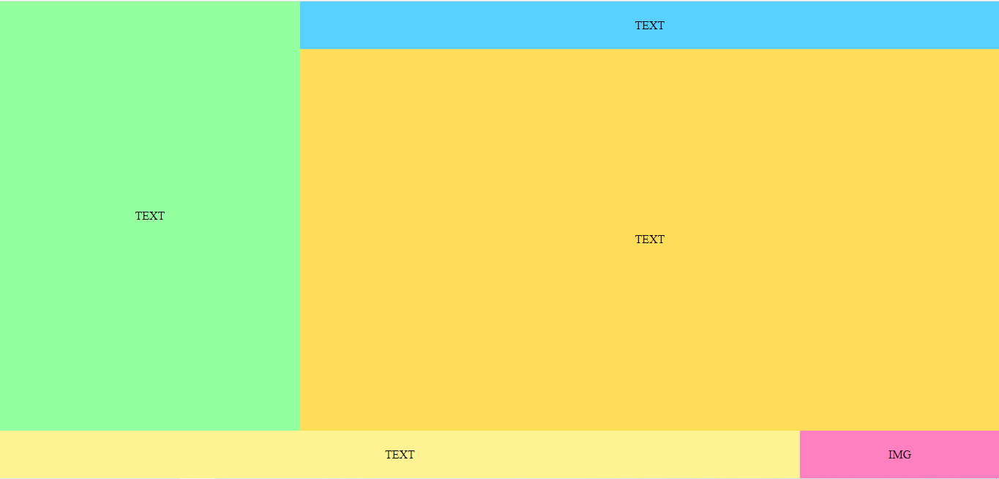

# Лабораторна робота 1
Варіант 100

**Тема: Блочна верстка макету сайту за допомогою HTML і CSS**

Завдання 1. За допомогою HTML5 та CSS3 зробити блочну верстку розробленого макету використовуючи технологію float. Обов’язково використати width у відсотках. 

Завдання 2. Створити верстку цього ж макету сайту за допомогою технології flex/grid.

### Результат

